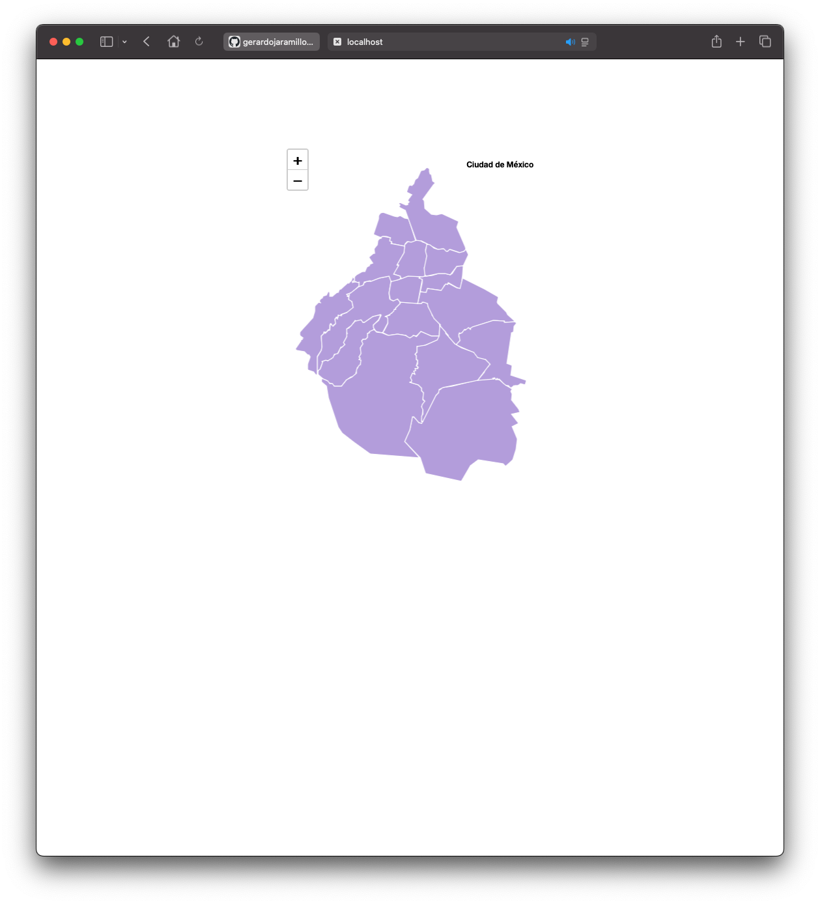

# lab-nodejs-leaflet 

## GitHub

```
git clone https://github.com/gerardojaramillo/lab-nodejs-leaflet.git
```
Cool, you have a copy !

## NodeJS v25 or major

to run it in NodeJS, place in the folder lab-nodejs-leaflet and type next:

```
npm update
npm run start
```

## Docker is required

Works well in Docker 28 version or major

if you want it to run locally in docker, go to the folder lab-nodejs-leaflet, type and execute the command below

```
docker compose up -d
docker compose down (shut it down)
```

after a few seconds the image is created, open browser and type http://localhost:8080/

Ualá ! a basic geojson map ! but with a lot of potential.

